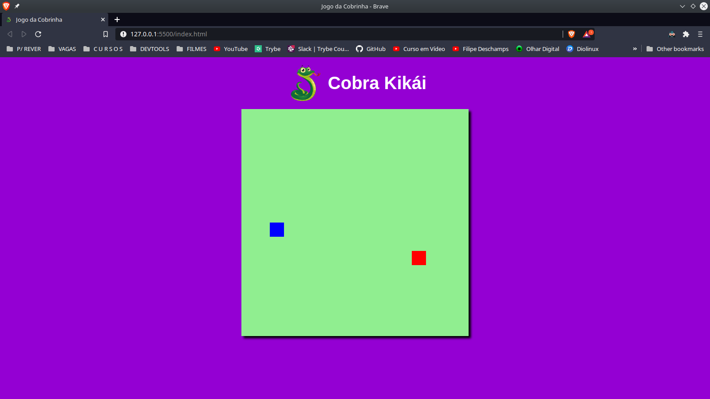
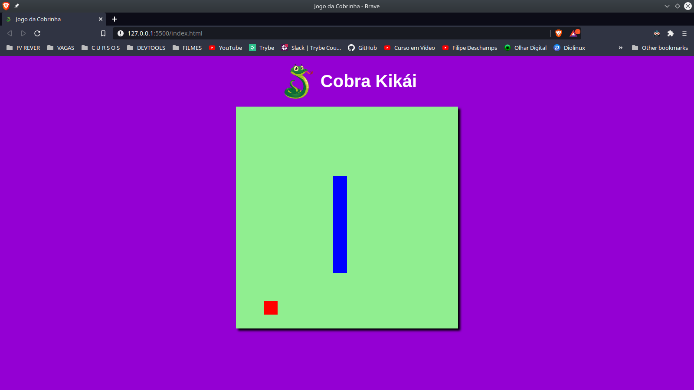
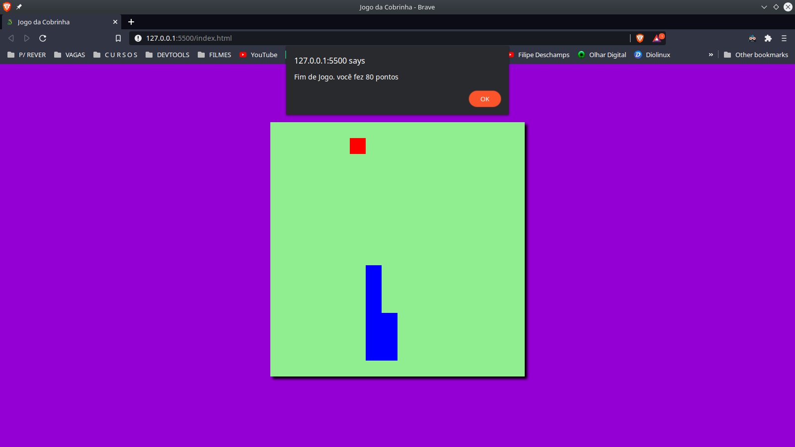
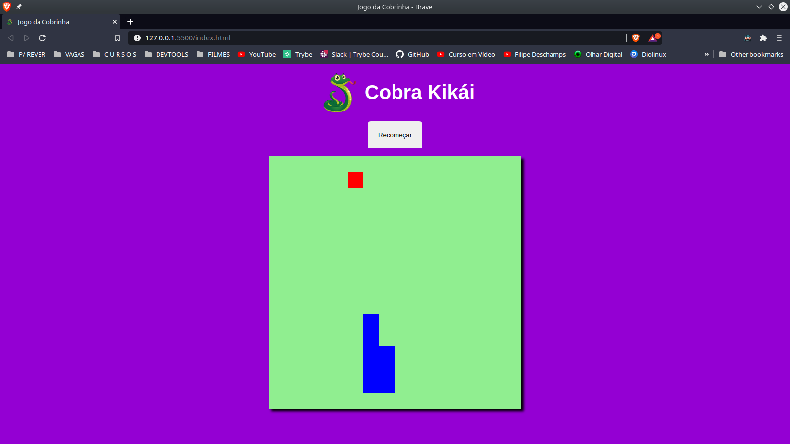

# Cobra Kikái

#### Também conhecido como jogo da cobrinha.

## Por que esse projeto?

Projeto realizado conforme **desafio** lançado no Bootcamp **HTML Developer**.

Esse Bootcamp foi realizado através da **DIO**, [Digital innovation One](https://digitalinnovation.one/sign-up?ref=24BC2BCR9W)

## O que aprendi?

Esse projeto foi bem importante para rever muitos conceitos já estudados anteriormente, assim como me ajudou a evoluir minha visão sobre dinamicidade de informações, utilizando apenas #HTML, #CSS e #JavaScript.

## Telas do jogo:

Início:

Jogando:

Fim de jogo:

Recomeçar:

